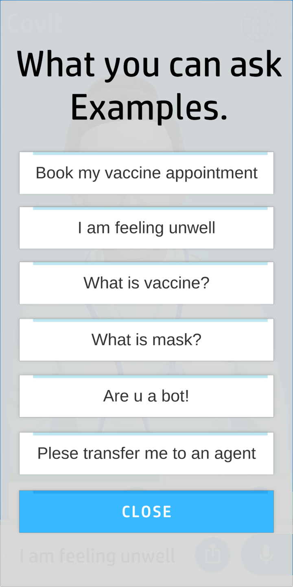

# CovIt - 3d virtual covid doctor assistant

CovIt is 3d bot doctor virtual assistant application, where a human bot named doctor dia helps the user to solve there covid-19 related queries by interacting via speech(voice) or simply by chat, the unique feature of the application is, it feels like doctor is in front of you, and you can share your problem with the him very easily, and bot doctor can also book a slot for vaccine for you, instead of filling form by typing, simply speak to bot(dia the docter) she will do it in a minute. it will be very helpful for the people of the india & world, due lack of availability of doctors, patients can directly consult to our AI Powered bot, and get there question clear.

### Screenshots

     

[Watch the video presentation on YouTube](https://www.youtube.com/watch?v=X7KaWGyfjP0)

## Downloads

<a href="https://drive.google.com/file/d/1viGnVDJyu3s9ODzitpR0HBBpB0d7DOYi/view"></img></a>

### Block Diagram

### Tech Stack
# Unity Engine

3d model and ui integration with oculus modules and IBM watson webhooks

# IBM Watson

NLP, Bot training , integration with twillio for whatsapp api 

# Oculus Lipsync SDK

Lip syncing of model 

# Blender

Chatbot modelling, UI 

